# 📊 Customer, Product, and Profitability Performance Analysis in Supply Chain Operations

An interactive business intelligence dashboard developed using **Python, Streamlit, Pandas, and Plotly** to analyze customer profitability, product margins, discount impact, regional performance, and supply chain efficiency.

This project helps transform raw operational data into meaningful business insights for smarter decision-making.

---

## 🌐 Live Demo
[https://your-streamlit-link.streamlit.app](https://supply-chain-analytics-dashboard-nmgjzycwemcfmn4wzwb52o.streamlit.app/)

---

## 🚀 Project Overview

For logistics companies, high sales do not always guarantee high profit. Hidden costs such as discounts, low-margin products, inefficient shipping modes, and weak-performing regions can reduce overall profitability.

This dashboard was built to provide complete visibility into business performance by answering key questions:

- Which customers generate the highest value?
- Which products and categories are most profitable?
- How do discounts impact margins?
- Which markets and regions perform best?
- Which shipping methods are most efficient and profitable?

---

## 🎯 Project Objectives

- Analyze revenue and profit performance
- Identify high-value and loss-making customers
- Measure profitability across products and categories
- Detect margin erosion caused by discounts
- Compare market and regional performance
- Evaluate shipping efficiency and profitability
- Support data-driven pricing and business strategy

---

## 🛠️ Technology Stack

| Technology | Purpose |
|-----------|---------|
| Python | Core programming language |
| Pandas | Data cleaning and analysis |
| Streamlit | Interactive dashboard development |
| Plotly | Advanced visualizations |
| NumPy | Numerical operations |
| CSS | Custom UI styling |

---

## 📈 Dashboard Modules

### 1️⃣ Revenue & Profit Overview

Provides a high-level financial summary of the business.

**Features:**
- Total Revenue
- Total Profit
- Revenue vs Profit comparison
- Market-wise profit margin trends

**Business Value:**  
Helps evaluate whether strong sales are translating into healthy profitability.

#### Screenshot

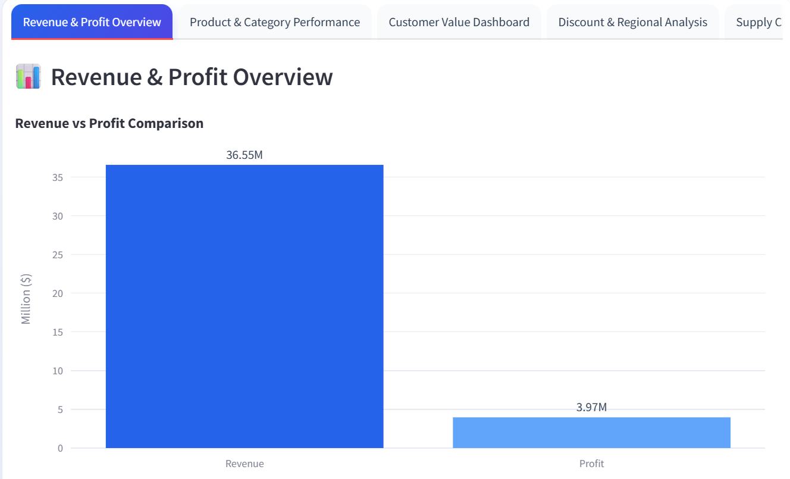

---

### 2️⃣ Product & Category Performance

Analyzes profitability at product and category level.

**Features:**
- Top profitable categories
- Product margin analysis
- Category profitability heatmap
- Identification of weak-margin products

**Business Value:**  
Supports pricing, inventory, and product portfolio decisions.

#### Screenshots

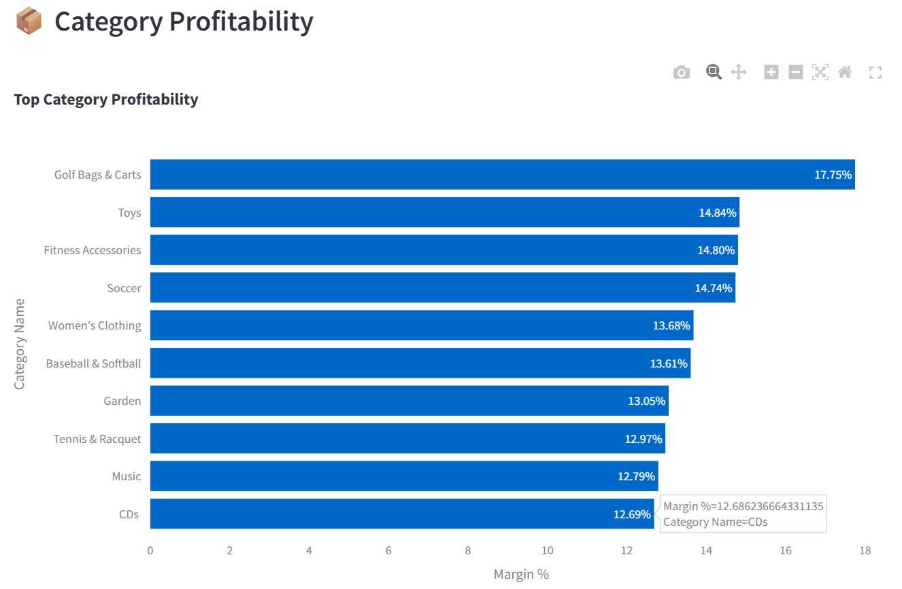

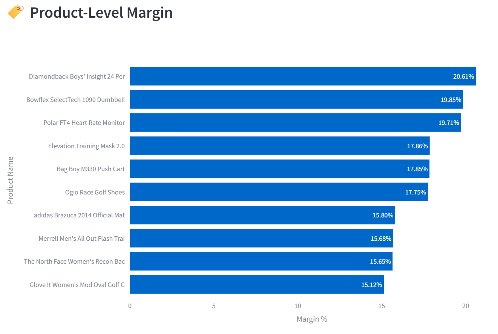

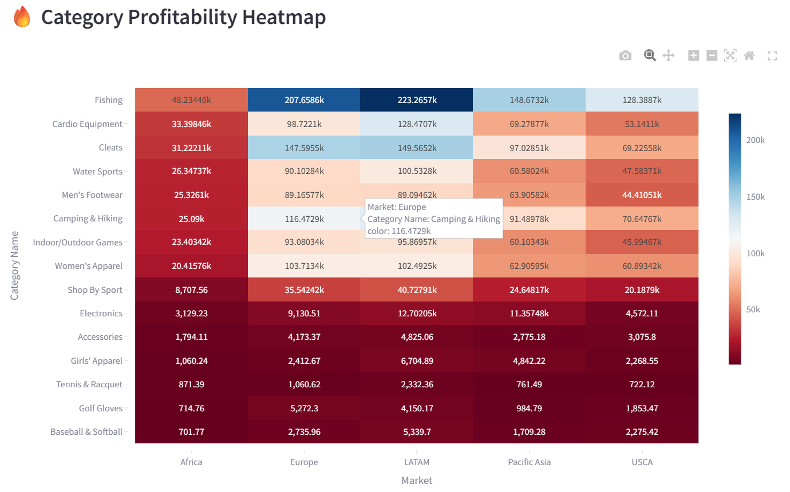

---

### 3️⃣ Customer Value Dashboard

Measures profitability contribution of customers.

**Features:**
- Top profitable customers
- Loss-making customers
- Customer segment contribution
- Customer Value Index

**Business Value:**  
Improves customer retention strategy and profitability targeting.

#### Screenshots

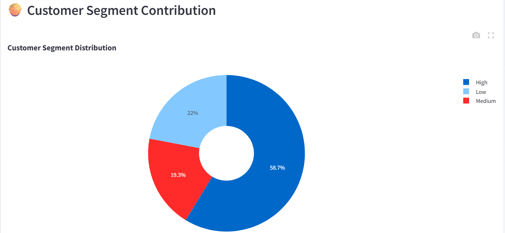

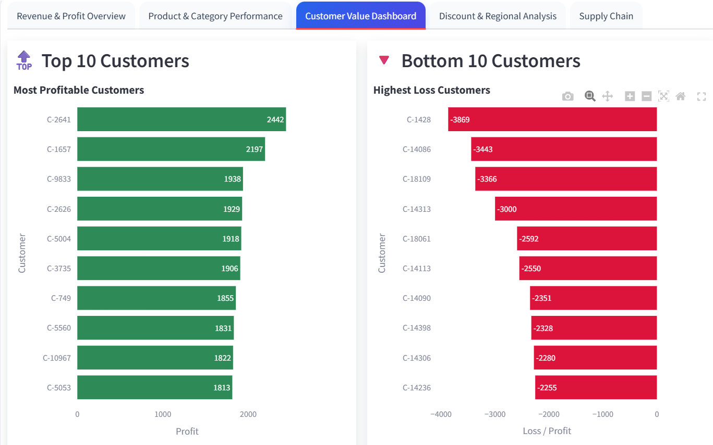

---

### 4️⃣ Discount & Regional Analysis

Examines how discounts affect profit margins and regional performance.

**Features:**
- Discount vs margin relationship
- What-if discount simulator
- Top profitable regions
- Regional comparison charts

**Business Value:**  
Enables better discount planning and regional strategy.

#### Screenshots

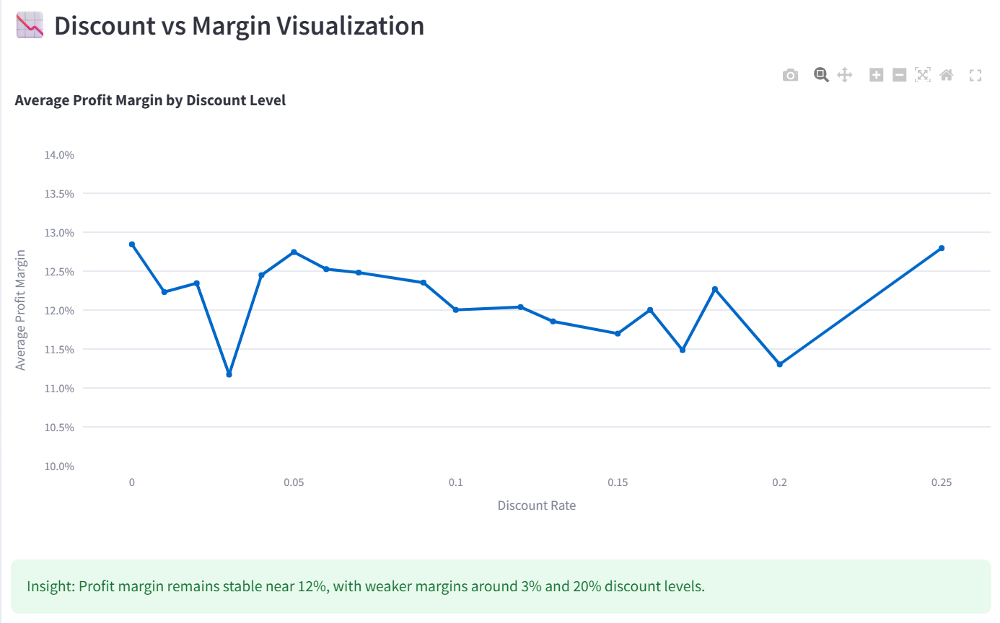

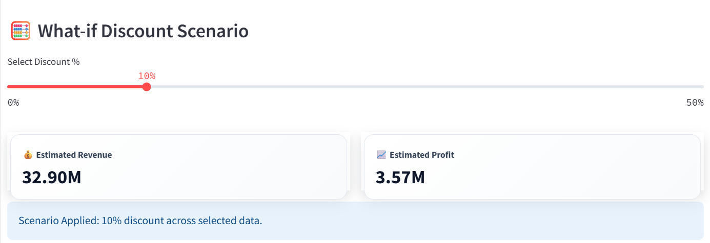

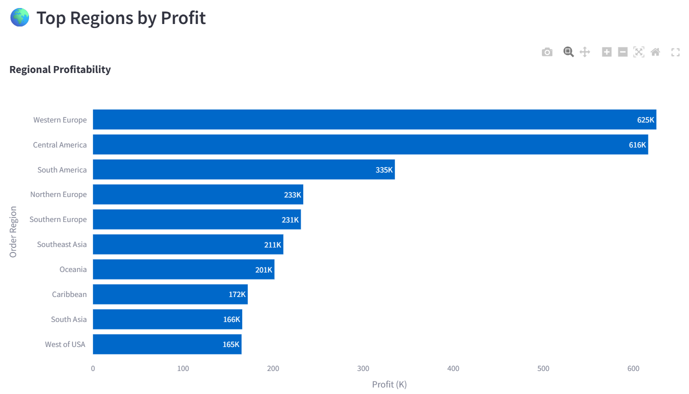

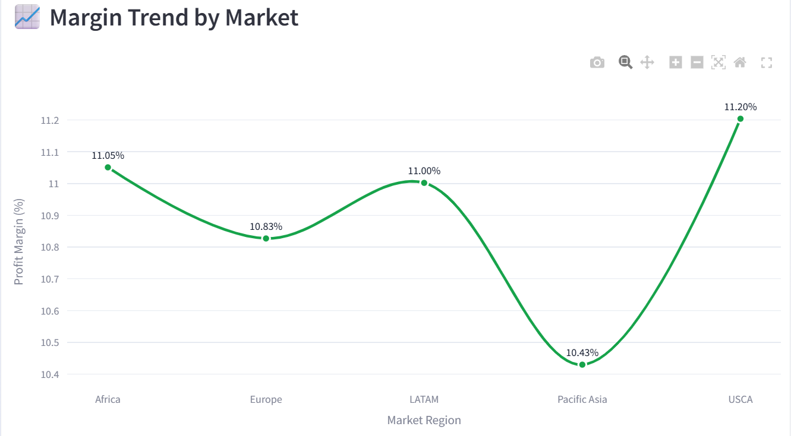

---

### 5️⃣ Supply Chain Performance

Focuses on logistics efficiency and delivery profitability.

**Features:**
- Actual vs scheduled shipping days
- Delay analysis
- Shipping mode profitability
- Best performing shipping methods

**Business Value:**  
Helps optimize logistics cost and delivery performance.

#### Screenshots

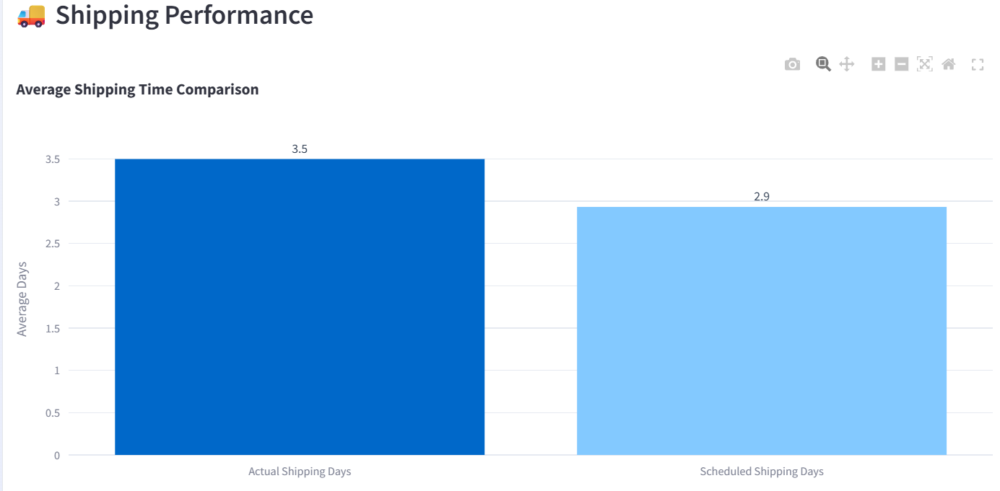

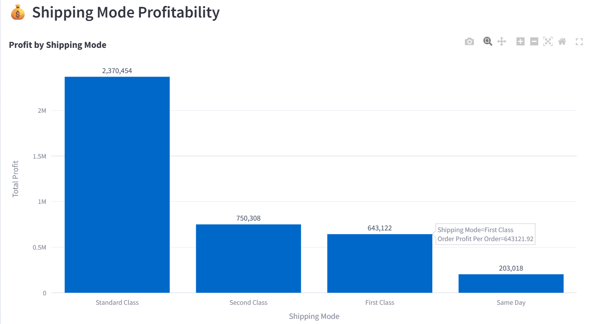

---

## 📊 Key Performance Indicators (KPIs)

- Total Revenue  
- Total Profit  
- Profit Margin (%)  
- Customer Value Index  
- Category Margin  
- Discount Impact Ratio  

#### Screenshot

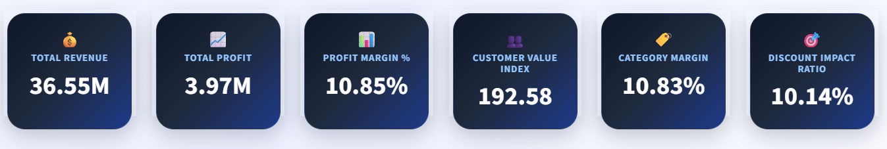

---

## 🎛️ Interactive Filters

Users can dynamically filter the dashboard using:

- Customer Segment
- Category
- Product Name
- Market
- Order Region
- Shipping Mode
- Discount Rate Range

#### Screenshot

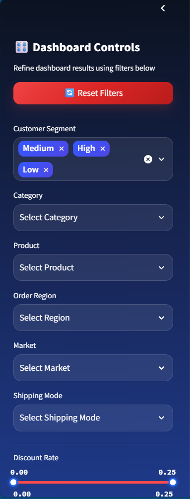

---

## 📁 Project Structure

```text
APL-Logistics-Profitability-Dashboard/
│── app.py
│── requirements.txt
│── README.md
│── data/
│── screenshots/
│   ├── Revenue&Profit.png
│   ├── CategoryProfitability.png
│   ├── ProductLevelMargin.png
│   ├── HeatMap.png
│   ├── CustomerSegment.png
│   ├── Top10Bottom10.png
│   ├── DiscountVsMargin.png
│   ├── WhatIf.png
│   ├── TopProfit.png
│   ├── MarginTrend.png
│   ├── ShipPerformance.png
│   ├── ShippingProfitability.png
│   ├── KPIs.png
│   └── filters.png
```

---

## 💼 Business Value

This dashboard helps organizations identify:

- Most profitable customers
- Best product categories
- Weak-margin regions
- Discount leakage areas
- Shipping inefficiencies

---

## 🔮 Future Enhancements

- Machine Learning Forecasting
- SQL Integration
- Live Data API
- PDF Export Reports
- Authentication System
- Email Alerts

---

## 👨‍💻 Developed By

Kundan Kumar Singh

---

## ⭐ Support

If you found this project useful, give it a Star on GitHub.
